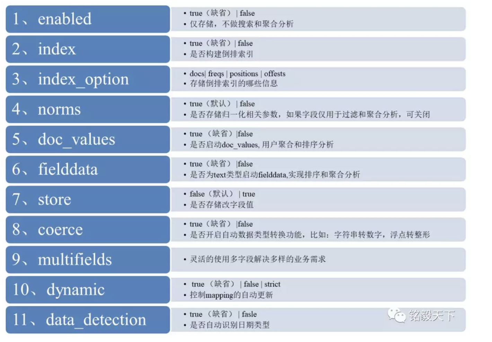
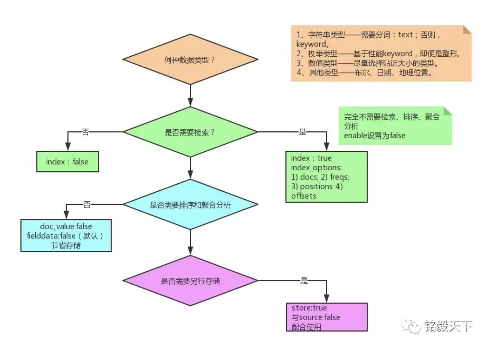

### ES 安装

```
docker pull elasticsearch:6.6.1


docker run -d --name elasticsearch -p 9200:9200 -p 9300:9300 -e "discovery.type=single-node" elasticsearch:6.6.1

9300是tcp通讯端口，集群间和TCPClient都走的它，
9200是http协议的RESTful接口 
```


## ES 和 MYSQ 区别

```
Relational DB -> Databases -> Tables -> Rows -> Columns -> Schema
Elasticsearch -> Indices   -> Types  -> Documents -> Fields -> Mapping
```

#### 文字描述

1.  关系型数据库中的数据库（DataBase），等价于ES中的索引（Index）
2.  一个数据库下面有N张表（Table），等价于1个索引Index下面有N多类型（Type）
3.  一个数据库表（Table）下的数据由多行（ROW）多列（column，属性）组成，等价于1个Type由多个文档（Document）和多Field组成。   
4.  在一个关系型数据库里面，schema定义了表、每个表的字段，还有表和字段之间的关系。 与之对应的，在ES中：Mapping定义索引下的Type的字段处理规则，即索引如何建立、索引类型、是否保存原始索引JSON文档、是否压缩原始JSON文档、是否需要分词处理、如何进行分词处理等。
5.  在数据库中的增insert、删delete、改update、查search操作等价于ES中的增PUT/POST、删Delete、改_update、查GET.   

### ES 的数据类型

#### 字符串类型

1.  text

    当一个字段是要被全文搜索的，比如Email内容、产品描述，应该使用text类型。设置text类型以后，字段内容会被分析，在生成倒排索引以前，字符串会```被分析器分成一个一个词项```。text类型的字段```不用于排序```，很少用于聚合。

2.  keyword

keyword类型适用于索引结构化的字段，比如email地址、主机名、状态码和标签。如果字段需要进行```过滤```(比如查找已发布博客中status属性为published的文章)、```排序、聚合```。keyword类型的字段只能通过```精确```值搜索到。


#### 数字类型

|  类型   |         取值范围         |
| :-----: | :----------------------: |
|  byte   |         -128~127         |
|  short  |       -32768~32767       |
| integer | -$$2^{31}$$~$$2^{31}$$-1 |
|  long   | -$$2^{63}$$~$$2^{63}$$-1 |


#### 浮点数类型

|     类型     |          取值范围          |
| :----------: | :------------------------: |
|    doule     | 64位双精度IEEE 754浮点类型 |
|    float     | 32位单精度IEEE 754浮点类型 |
|  half_float  | 16位半精度IEEE 754浮点类型 |
| scaled_float |     缩放类型的的浮点数     |


#### map设置




***map设置流程图***




*** demo ***

```json
PUT blog_index
{
  "mappings": {
    "doc": {
      "_source": {
        "enabled": false
      },
      "properties": {
        "title": {
          "type": "text",
          "fields": {
            "keyword": {
              "type": "keyword",
              "ignore_above": 100
            }
          },
          "store": true
        },
        "publish_date": {
          "type": "date",
          "store": true
        },
        "author": {
          "type": "keyword",
          "ignore_above": 100, 
          "store": true
        },
        "abstract": {
          "type": "text",
          "store": true
        },
        "content": {
          "type": "text",
          "store": true
        },
        "url": {
          "type": "keyword",
          "doc_values":false,
          "norms":false,
          "ignore_above": 100, 
          "store": true
        }
      }
    }
  }
}
```


### 查询

#### **match**

```
match的查询词会被分词

match_phrase 不会分词

```


#### term

```
 term代表完全匹配，不进行分词器分析
```


#### bool联合查询

```
must 完全匹配 相当于and

should 至少满足一个  or

must_not不匹配
```


-   match_phrase/match_phrase_prefix
-   term/terms
-   wildcard/regexp
-   query_string


### [查询优化]([http://arganzheng.life/deep-pagination-in-elasticsearch.html](http://arganzheng.life/deep-pagination-in-elasticsearch.html))

1.  from size
2.  服务端缓存 Scan and scroll API
3.  search after

### 学习地址

[基础介绍](https://blog.csdn.net/laoyang360/article/details/52244917)
[系列课程](https://blog.csdn.net/laoyang360/article/details/79293493)