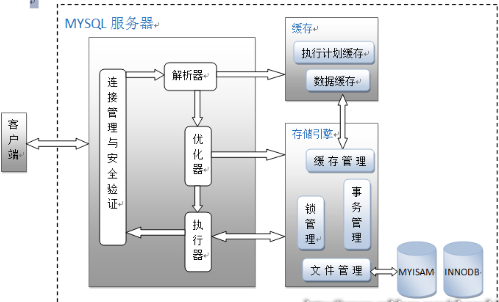
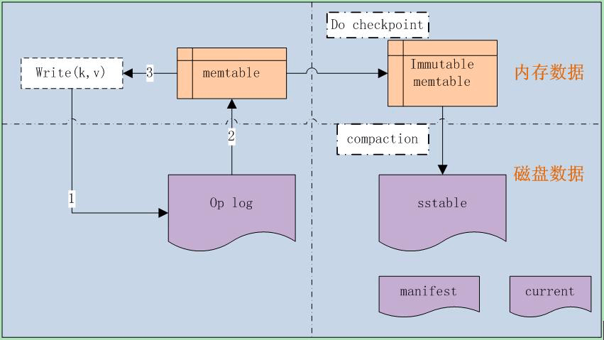

## MYSQL

### 常用函数

####  时间格式化函数

```
UNIX_TIMESTAMP('2018-07-01 0:0')

from_unixtime(`create_time`) 
```


#### mysql的坑

```
当查询数据类型和索引数据类型不一致的时候，查询不走索引
```


### [当执行一条sql的时候发生了什么](<https://juejin.im/post/5c91b5d7e51d456f957ebd10>)


#### mysql的框架结构




mysql主要分为Server层和存储引擎层

**Server层**：主要包括连接器、查询缓存、分析器、优化器、执行器等，所有跨存储引擎的功能都在这一层实现，比如存储过程、触发器、视图，函数等，还有一个通用的日志模块 binglog日志模块。

**存储引擎**： 主要负责数据的存储和读取，采用可以替换的插件式架构，支持InnoDB、MyISAM、Memory等多个存储引擎，其中InnoDB引擎有自有的日志模块redolog 模块。

InnoDB 5.5.5版本作为默认引擎。

**连接器**

主要负责用户登录数据库，进行用户的身份认证，包括校验账户密码，权限等操作，如果用户账户密码已通过，连接器会到权限表中查询该用户的所有权限，之后在这个连接里的权限逻辑判断都是会依赖此时读取到的权限数据，也就是说，后续只要这个连接不断开，即时管理员修改了该用户的权限，该用户也是不受影响的。

**查询缓存**

连接建立后，执行查询语句的时候，会先查询缓存，Mysql会先校验这个sql是否执行过，以Key-Value的形式缓存在内存中，Key是查询预计，Value是结果集。如果缓存key被命中，就会直接返回给客户端，如果没有命中，就会执行后续的操作，完成后也会把结果缓存起来，方便下一次调用。当然在真正执行缓存查询的时候还是会校验用户的权限，是否有该表的查询条件。

Mysql 查询不建议使用缓存，因为对于经常更新的数据来说，缓存的有效时间太短了，往往带来的效果并不好，对于不经常更新的数据来说，使用缓存还是可以的，***  Mysql 8.0 版本后删除了缓存的功能 ***，官方也是认为该功能在实际的应用场景比较少，所以干脆直接删掉了。

**分析器**

mysql 没有命中缓存，那么就会进入分析器，分析器主要是用来分析SQL语句是来干嘛的，分析器也会分为几步：

**第一步，词法分析**，一条SQL语句有多个字符串组成，首先要提取关键字，比如select，提出查询的表，提出字段名，提出查询条件等等。做完这些操作后，就会进入第二步。

**第二步，语法分析**，主要就是判断你输入的sql是否正确，是否符合mysql的语法。

完成这2步之后，mysql就准备开始执行了，但是如何执行，怎么执行是最好的结果呢？这个时候就需要优化器上场了。

**优化器**

优化器的作用就是它认为的最优的执行方案去执行（虽然有时候也不是最优），比如多个索引的时候该如何选择索引，多表查询的时候如何选择关联顺序等。

**执行器**

当选择了执行方案后，mysql就准备开始执行了，首先执行前会校验该用户有没有权限，如果没有权限，就会返回错误信息，如果有权限，就会去调用引擎的接口，返回接口执行的结果。


#### 总结

Mysql 主要分为Server曾和引擎层，Server层主要包括连接器、查询缓存、分析器、优化器、执行器，同时还有一个日志模块（binlog），这个日志模块所有执行引擎都可以共用。

引擎层是插件式的，目前主要包括，MyISAM,InnoDB,Memory等。

查询语句的执行流程如下：权限校验（如果命中缓存）---》查询缓存---》分析器---》优化器---》权限校验---》执行器---》引擎

更新语句执行流程如下：分析器----》权限校验----》执行器---》引擎---redo log(prepare 状态---》binlog---》redo log(commit状态)

## LevelDB

### 特点

*   写入速度，明显大鱼读取速度

[](http://taobaofed.org/blog/2017/07/05/leveldb-analysis/)

