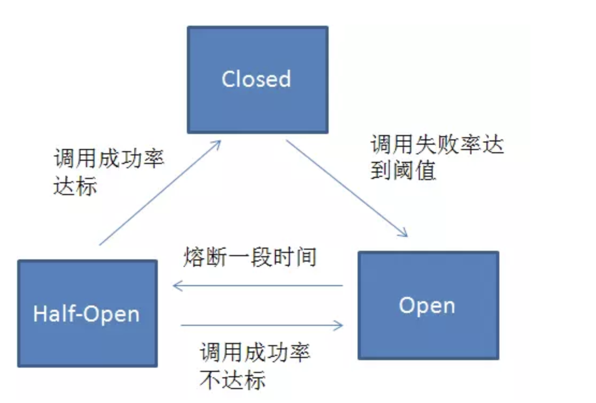

## RPC

http://www.php20.cn/article/149

https://github.com/easy-swoole/rpc


## 熔断器

```
当微服务的运行质量低于某个临界值时，启动熔断机制，暂停微服务调用一段时间，以保障后端的微服务不会因为持续过负荷而宕机。
```

-   关闭：让请求通过的默认状态。如果请求成功/失败但低于阈值，则状态保持不变。可能出现的错误是超过最大并发数和超时错误。
-   打开：当熔断器打开的时候，所有的请求都会被标记为失败；这是故障快速失败机制，而不需要等待超时时间完成。
-   半开：定期的尝试发起请求来确认系统是否恢复。如果恢复了，熔断器将转为关闭状态或者保持打开。

