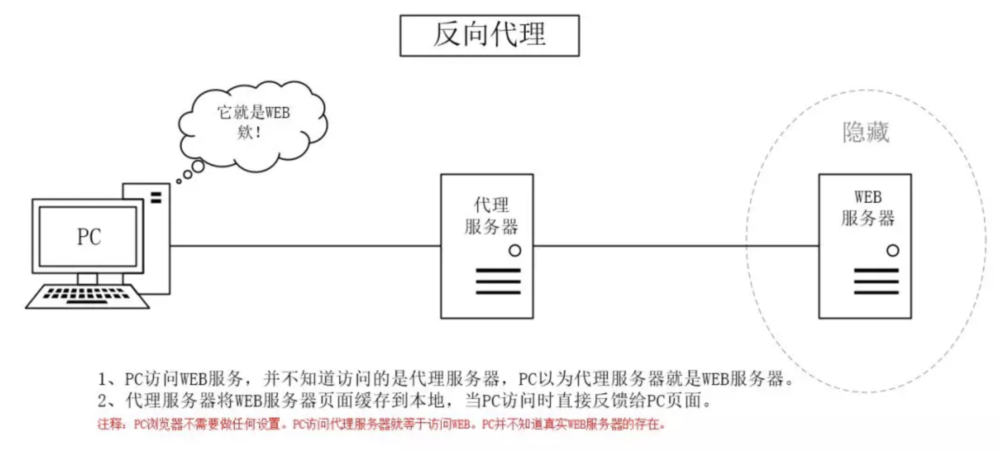
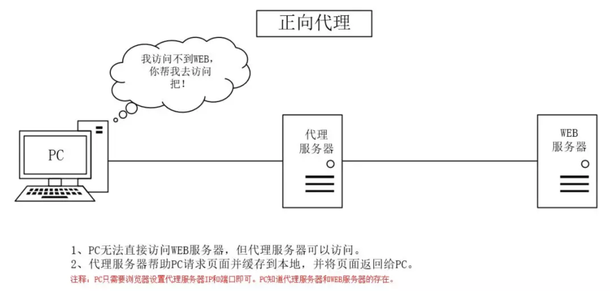

#[代理](https://mp.weixin.qq.com/s/T7vd5heXXUjnbV-1wHg8xg)

## 学习[地址](https://mp.weixin.qq.com/s/T7vd5heXXUjnbV-1wHg8xg)https://mp.weixin.qq.com/s/T7vd5heXXUjnbV-1wHg8xg

### 反向代理

```
以代理服务器来接受internet上的连接请求，然后将请求转发给  ***内部网络上的服务器*** ，并将从服务器上得到的结果返回给internet上请求连接的客户端，此时代理服务器对外就表现为一个反向代理服务器。

反向代理，其实是"代理服务器"代理了"目标服务器"，去和"客户端"进行交互。
```




#### 反向代理用途

**隐藏服务器真实IP**

**负载均衡**

```
反向代理服务器可以做负载均衡，根据所有真实服务器的负载情况，将客户端请求分发到不同的真实服务器上。
```


**提高访问速度**

**提供安全保障**

```
反向代理服务器可以作为应用层防火墙，为网站提供对基于Web的攻击行为（例如DoS/DDoS）的防护，更容易排查恶意软件等。还可以为后端服务器统一提供加密和SSL加速（如SSL终端代理），提供HTTP访问认证等。
```


### 正向代理

```
一个位于客户端和目标服务器之间的服务器(代理服务器)，为了从目标服务器取得内容，客户端向代理服务器发送一个请求并指定目标，然后代理服务器向目标服务器转交请求并将获得的内容返回给客户端

正向代理，其实是"代理服务器"代理了"客户端"，去和"目标服务器"进行交互。
```




### 正向代理的用途

**突破访问限制** 

```
通过代理服务器，可以突破自身IP访问限制，访问国外网站，教育网等
```

**提高访问速度**

```
通常代理服务器都设置一个较大的硬盘缓冲区，会将部分请求的响应保存到缓冲区中，当其他用户再访问相同的信息时， 则直接由缓冲区中取出信息，传给用户，以提高访问速度
```


**隐藏客户端真实IP**

```
上网者也可以通过这种方法隐藏自己的IP，免受攻击。
```


## 网络协议

